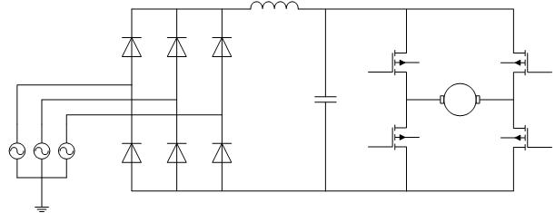

# Project-2: Design of DC motor drive

## Definition

In this project, you will be dealing with:

* Modeling and simulation of 4Q DC motor drives with power electronics
* Applying open-loop and closed-loop control
* Circuit design and component selection
* DC motor modes of operation

As in the previous project, the model that you will build and your results should be **completely on your own**.

Please see the [motor ratings, design requirements and other parameters assigned to you](https://github.com/odtu/ee462/blob/master/Project_2/motordata.md) .

The available supply is three-phase grid voltage with 230 Vrms, and 50 Hz ratings. The load profile is also assigned to you individually. The most general motor drive circuit for such a case is shown in Fig. 1.

Fig. 1: The most general 4Q motor drive circuit

## Project Content

### Part I (10 pts).

#### Deadline:
10/04/2017 23:59

## Part A: Preliminary Design
1. Design the filter component values to obtain 1% peak-to-peak ripple voltage at the DC bus (no analytic explanation is necessary, but try to choose realistic values (i.e. in the range of mH and mF)).
2. Decide the switching frequency. Consider the electrical time constant of the motor. The armature current peak-to-peak ripple should not exceed 1%.

NOTE: You may finalise your design with the simulation work in Part B; however, you need to show your theoretical approach in Part A. Applying only "trial and error" method is not accepted.

## Part B: Modeling and Simulation
1. Model the rectifier circuit with DC link filter. Connect a resistive load (which represents the whole motor drive - motor - load combination) and obtain voltage and current waveforms, and show that DC bus voltage ripple is less than 1%. The load resistor, which represents the power output, should be selected according to the rated power output of the motor.
2.
  * Model the 4Q chopper circuit along with the DC motor. Connect a constant ideal DC source to the DC bus (Do not use the rectifier yet!).
  * Construct generic a PWM subsystem which can generate gate signals for all the transistors separately and can be used for all operation mode applications (forward motoring, reverse motoring etc.).
  * Drive the motor with 60% duty cycle PWM in forward motoring mode. Obtain armature voltage, armature current, torque and speed waveforms.
3. Now, connect these two models and obtain the same characteristics asked previously for both parts. Comment on the differences on the waveforms; i.e., the effect of one side to another.

## Part C: Control
### Open loop control
In this part, use the combined model (Part B-3). Set the initial capacitor voltage close to its steady state value to ignore the starting transient of rectifier.
1.  * Obtain the torque expression of the motor in terms of speed and terminal voltage, at steady state. In addition, obtain the expression of the duty cycle in terms of speed and torque.
  * Calculate the duty cycle that should be applied to the motor to operate at its rated speed under rated load torque, in forward motoring mode.
  * Apply the proper gate signals to the chopper according to your calculation and obtain armature voltage, current, torque and speed waveforms. The initial motor speed should be zero.
  * Comment on the results.
2.  * Calculate the duty cycle that should be applied to the motor to operate at half of its rated speed under rated load torque, in forward motoring mode.
  * Apply a step change to the duty cycle applied to the motor drive from the value in (1) to (2). Obtain armature voltage, current, torque and speed waveforms.
  * Comment on the results and the operating modes. Use power semiconductor device waveforms to prove your statement.
3.  * Apply a step change to the duty cycle from the value in (2) to in (1). Obtain armature voltage, current, torque and speed waveforms.
  * Comment on the results and the operating modes. Use power semiconductor device waveforms to prove your statement.
4.  * Calculate the duty cycle that should be applied to the motor to operate at its rated speed under rated load torque, in reverse motoring mode.
  * Apply the transition from forward motoring to reverse motoring mode with proper gate signals. Obtain armature voltage, current, torque and speed waveforms.
  * Comment on the results and the operating modes. Use power semiconductor device waveforms to prove your statement.
5. * Comment on the practical limitations of the methods.
  * Propose methods for the transitions.

### Closed loop control:
1. * Propose and implement a PID type current controller for the DC motor drive for start-up. The aim is to accelerate the motor from standstill to its rated speed with 150% of its rated torque (hence 150% of its rated current). Constant load torque (rated) should be applied to the motor. Obtain armature voltage, current, torque and speed waveforms.
 * Propose and implement a hysteresis (on-off) type current controller for the DC motor drive for start-up. The same requirements and specifications are valid as in (1). Obtain armature voltage, current, torque and speed waveforms.
 * Compare the two methods and comment.
Note that, the torque (or current reference will be provided by the user with this type of control.
2. * Now, add a speed controller to your model, which generates the torque (or current) reference for the current controller. Notice that, this reference was applied by hand in the previous part. Now, the the control loops are combined together. This method is called double loop control. Also note that, speed reference will be set by the user, this time.
* Test your controller by applying step change to the speed reference.
* Explain brifly how this type of control system works, theoretically.
HINT: If you write down very basic analytical models (differential equations), it will help you a lot. You can also utilize waveforms for your explanation.
* Comment on the performance of your controller.

### Part II (5+3 pts).

#### Deadline:
24/04/2017 23:59

### Part D: Circuit Design
1. What may be most proper power semiconductor type for this application? Give reasoning (i.e. which type of Mosfet or igbt, etc)
2. Select a commercially available transistor (with anti-parallel diode) and explain your reasoning. Use simulation outputs to prove your statement. (link verelim)
3. Select rectifier diodes. (link verelim)
4. Loss calculation???

### Part E-Bonus (3 pts): Braking
1. What will happen when the drive is kept in braking state (plugging mode) for a long time? Prove your statement with simulation outputs.
2. Propose a method to overcome the problem in Part 1.
3. Implement the method you proposed and show that it solves the problem using simulation models.

Comments are the most important section of your project report. Please explain both your models and results as detailed as possible. This part does not need to be a separate part, but the comments can be included after each analysis part. Please refer to [evaluation sheet](https://github.com/odtu/ee462/blob/master/Project_1/evaluation.md) for details.

## HINTS:

* When constructing the models, go **step-by-step**. First built a few components, check if it is working as intended, if it works then add new components. Do not try to implement the whole model at once, expect it to work without any problems.
* Always be aware to use **correct units**.
* Understand the **analytical model** before constructing the models.
* If you have any problems with your models, you can always [open an issue in GitHub](https://guides.github.com/features/issues/) for online feedback, or visit the course assistant and lecturer during the office hours.
*  Do not forget to cite to any external sources you used.

## Submission

You have to submit at least the following files:

- The Simulink models (either as three separate files or a combined model)
- A project report describing your models in detail (Your simulation results should be embedded in your report).
