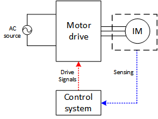

# Project-3: Design of Induction Motor Drive

## Definition

In this project, you will be dealing with:

* Characterization of the motor from the given data
* Designing induction motor drive system for a specific application
  * Drive topology proposition
  * Power stage design
  * Control system design
* Modeling and simulation of the proposed design in MATLAB/Simulink
* Applying open-loop control for different operating modes
* Performance evaluation of the designed drive system
* Applying closed-loop control

As in the previous projects, the model that you will build and your results should be **completely on your own**.

Please see the [motor ratings, design requirements and other parameters assigned to you](https://github.com/odtu/ee462/blob/master/Project_3/motordata.md) .

The available supply is a three-phase AC source and the induction motors are squirrel cage type. The load profile is also assigned to you individually. The induction motor drive system is shown in Fig. 1.

Fig. 1: The induction motor drive system

# Project Content

# Part I :(20 pts)

### Part I Deadline: 09/05/2017 03:59

## Part A: Motor Characterization

1. Using the motor specs and and test data, obtain and plot the **torque-speed characteristics** of the induction motor assigned to you using MATLAB (not Simulink).
2. Determine the starting torque, pull-out torque and the rated torque values, both analytically and label the relevant points in the graph.
3. Plot torque-speed curves at 4 different **Constant Volts/Hertz** combinations on the same graph. Comment on how will affect to have constant E/f compared to constant V/f.

## Part B: Drive proposition

1. Considering the supply, motor and load requirements, propose a **power stage topology** for a four-quadrant speed controlled motor drive system. Draw the circuit diagram and explain the components. Give full reasoning.
2. Define the measured parameters (i.e. required sensors) and your control control variables. Explain your proposition.
3. Sketch a block diagram showing the closed loop control system and define each part. Note that your diagram may be composed of multiple control stages. Do not copy the control block from the Internet, and explain the subsystems in detail.

**NOTES**
* Although this part has low credit, it is very critical in this project. You will continue with the next parts building on this part.
* Consider all the requirements asked from you, not just a regular drive application.
* Your drive system may be composed of more than one controlled stage. In that case, indicate the asked parameters for all of them.
* Your drive may not be the most optimum one, it is OK. But, your proposition should be reasonable and implementable.

# Part II :(30 pts)

### Part II Deadline: 16/05/2017 03:59

## Part C: Modeling and open loop control

1. Design an **open loop control system (constant Volts/Hertz)** for your motor drive. The control system should be capable of:
  * Soft-starting the motor (the starting current should not exceed twice of the rated current).
  * Control the speed with a given reference input.

Note that, this design includes selection of **switching frequency**.
2. Calculate the **control variables** and the **actual operating speed** for the following conditions, at steady state. You can utilize the model you built in Part A.
  * Forward motoring, rated load torque, rated speed
  * Forward motoring, rated load torque, half of the rated speed
  * Forward motoring, half of the rated load torque, rated speed
  * Forward generating, rated load torque, rated speed
  * Forward generating, rated load torque, half of the rated speed
  * Forward generating, half of the rated load torque, rated speed
2. **Model** the motor drive topology you proposed, and the open loop control system you designed, in MATLAB/Simulink. Apply proper references and verify the above calculations in the simulation.

# Part III :(30 pts)

### Part III Deadline: 19/05/2017 03:59

## Part D: Component selection and verification

1. Select the **power semiconductor devices** (diodes, IGBTs etc.) in your motor drive system using commercially available product catalogs. **Give reasoning.**
2. **Verify** your selections by using the simulation outputs at rated conditions (device voltages, currents etc.).

**NOTE:** You can also utilize your simulation models for component selection where necessary.  

## Part E: Loss characterization and efficiency calculation

1. Calculate **semiconductor device power losses** using simulation outputs, and device datasheet parameters. Explain each method, parameter, approximation and indicate any external source you used. It is highly advised to use **application notes** published by semiconductor device manufacturers.
2. Find the **efficiency** of the motor drive system at the rated conditions. Discuss the results you found.

**NOTES:**
* There are several ways for loss calculation. Getting accurate results takes too much effort. Therefore, use approximate methods from applications notes.
* The aim of this project is not designing the most optimum or the most efficient motor drive system. Whenever you think the performance of the motor drive is not good, comment on it and discuss how it can be improved. Do not try to soap down.
* If you find unrealistic values (for example 10% efficiency), go back to your design. Either you made a critical mistake in the design, or your calculations are not accurate.

# Part IV :(20 pts)

### Part IV Deadline: 26/05/2017 03:59

## Part G: Operating modes

1. Using your model, apply the following operating modes and obtain the related results (torque, speed etc.):
  * The motor accelerates from standstill to rated speed.
  * d
  * d
  * d
2. Comment the results.  

## Part H: Closed loop control

1. Model the closed loop system you proposed in previous parts, on MATLAB/Simulink.
2. Verify your design by showing a few sample results. Note that, the results should show that your closed loop model works properly. Therefore, include necessary simulation outputs.
3. Comment on the results.

# Part V :(20 pts-bonus)

### Part V Deadline: 02/06/2017 03:59

## Field oriented control

1.
  * T
  * d
  * d
  * d
2. C

Comments are the most important section of your project report. Please explain both your models and results as detailed as possible. Please refer to [evaluation sheet](https://github.com/odtu/ee462/blob/master/Project_3/evaluation.md) for details.

## HINTS:

* When constructing the models, go **step-by-step**. First built a few components, check if it is working as intended, if it works then add new components. Do not try to implement the whole model at once, expect it to work without any problems.
* Always be aware to use **correct units**.
* Understand the **requirements** before propositions.
* If you have any problems with your models, you can always [open an issue in GitHub](https://guides.github.com/features/issues/) for online feedback, or visit the course assistant and lecturer during their office hours.
*  Do not forget to cite to any external sources you used.

## Submission

You have to commit at least the following files until the deadline:

- MATLAB code for characterisation
- The Simulink models
- A project report describing your models in detail (Your simulation results should be embedded in your report).
